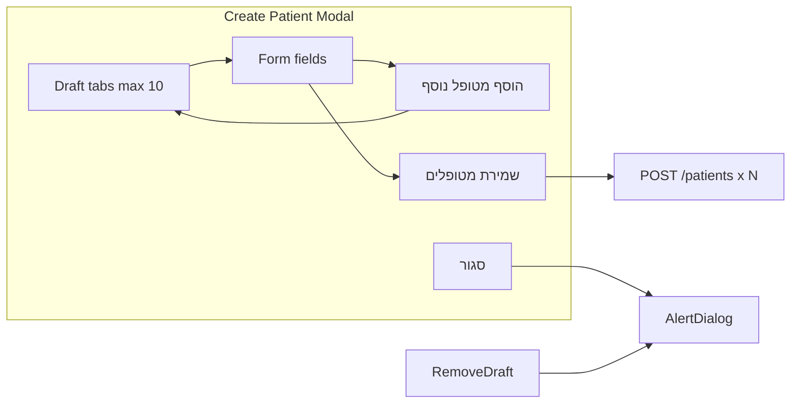

# Bulk Add Patients in Create Modal

## Current behavior

- Create is triggered via URL `?create=1`; [Patients/Index.tsx](resources/js/Pages/Patients/Index.tsx) passes `openCreateDialog` to [PatientDialog](resources/js/components/patients/PatientDialog.tsx).
- [PatientDialog](resources/js/components/patients/PatientDialog.tsx) uses [usePatientForm](resources/js/hooks/usePatientForm.ts) (Inertia `useForm`) and [PatientFormFields](resources/js/components/patients/PatientForm.tsx). Submit POSTs to `/patients` and on success calls `onClose()` (modal closes).
- Backend: [PatientController::store](app/Http/Controllers/PatientController.php) creates one patient; no bulk endpoint.

## Desired behavior

1. In **create** mode only (no `editPatient`), show draft tabs on top and an extra action: **"הוסף מטופל נוסף"**.
2. On click: push current form data into a **drafts** list, reset form to empty/default, keep modal open (no validation required to add).
3. **Drafts** are shown as **Chrome-like clickable tabs** on top of the modal (max 10); user can switch to edit any draft.
4. **Single primary action: "שמירת מטופלים" (Save all)** — the only way to save; no per-patient save. Submits drafts (and current form if filled) in list order via existing POST; on success close and clear. On partial failure (e.g. duplicate id_number from server), remove only successful drafts, keep failed ones, show one summary message.
5. **Duplicate id_number (teudat zehut)**: on **blur** of `id_number` field, check if value exists in another draft; if yes, show field error: **"מספר תעודת זהות זהה למטופל מספר {n}"** (n = 1-based index of the other draft in the list).
6. **Closing modal** or **removing a draft** when there are unsaved changes: show **AlertDialog** "Are you sure?" (unsaved changes) before proceeding.

## Edge cases (decisions)

| #   | Topic                             | Decision                                                                                                                                                                            |
| --- | --------------------------------- | ----------------------------------------------------------------------------------------------------------------------------------------------------------------------------------- |
| 1   | Empty form + "Add another"        | **A** — Allow adding to stack even when form is empty.                                                                                                                              |
| 2   | "Save all" button                 | **A** — Include "Save all" as the only save action (replace "שמירת מטופל").                                                                                                         |
| 3   | Validation when adding to stack   | **A** — No validation when adding to stack.                                                                                                                                         |
| 4   | Save button behavior              | **Save all only** — No per-patient save; user must use "שמירת מטופלים" to persist.                                                                                                  |
| 5   | Closing modal with unsaved drafts | **B** — Prompt with AlertDialog "Are you sure?" (unsaved changes) before closing.                                                                                                   |
| 6   | Many drafts                       | **B** — Limit to **10** drafts; show as **clickable buttons like Chrome tabs** on top of the modal.                                                                                 |
| 7   | Label for unnamed drafts          | **A** — "מטופל 1", "מטופל 2", … (1-based index).                                                                                                                                    |
| 8   | Removing a draft                  | **A** — Allow removing a draft (e.g. X on tab); prompt with AlertDialog "Are you sure?" when there are unsaved changes.                                                             |
| 9   | Order when Save all               | **A** — Save in list order (first added = first saved).                                                                                                                             |
| 10  | Duplicate id_number               | **Blur validation** — On blur of `id_number`, if value exists in another draft, show field error: **"מספר תעודת זהות זהה למטופל מספר {index}"** (1-based index of the other draft). |

## Architecture

- **State**: `drafts: Array<{ id: string; data: PatientFormData }>` (max 10), `activeDraftId: string | null` (null = "new" form). Form values = active draft data or default new.
- **Scope**: Bulk UX only when dialog is in **create** mode (`!patient`). Edit mode unchanged (single patient).

## Implementation plan

### 1. Bulk state and actions (new hook)

- Add `**useBulkAddPatients` in `resources/js/hooks/`.
- State: `drafts` (max 10), `activeDraftId`, current form data (from active draft or default).
- Actions: **Add another** (push current to drafts, reset form, stay under limit 10); **Select draft** (set active, load form); **Remove draft** (with unsaved-changes check via callback for AlertDialog); **Update form** (when editing a draft, sync back into `drafts`).
- **Save all**: loop over drafts + current form if filled, POST each in order; on 422 (e.g. id_number.unique) skip that one, keep in list, continue; at end remove only successful from list, show one summary toast/message if any failed; if all success, close and clear.
- Expose: `drafts`, `activeDraftId`, `addAnother`, `selectDraft`, `removeDraft`, `saveAll`, `getCurrentFormData` / `setCurrentFormData` (or integrate with form key/initial data for `usePatientForm` or manual submit).

### 2. Integrate with Inertia (Save all)

- **Save all** uses existing `POST /patients` per patient (no new backend). Either use `router.post` in a loop with `preserveState` and collect successes/failures, or build a small helper that submits one by one and aggregates. On each success remove that draft from local state; on 422 (validation) leave draft in list and continue.
- Optional: single success toast "נוספו X מטופלים"; if any failed: one message e.g. "חלק מהמטופלים לא נשמרו בשל כפילות במספר תעודת זהות" and keep failed drafts in the list.

### 3. PatientDialog UI (create mode only)

- When `!patient`:
    - **Top**: Draft tabs (Chrome-like) — clickable buttons, label = `draft.data.full_name || 'מטופל ' + (index+1)`, active state for `activeDraftId`, X to remove (with AlertDialog if unsaved). Max 10; disable "הוסף מטופל נוסף" when `drafts.length >= 10`.
    - **Body**: Same [PatientFormFields](resources/js/components/patients/PatientForm.tsx); form data and setData from bulk hook. **id_number** blur: run duplicate check across other drafts; if duplicate, set field error to "מספר תעודת זהות זהה למטופל מספר {otherDraftIndex+1}".
    - **Footer** (create mode): Use a `Button` for "הוסף מטופל נוסף" with **Plus icon** (`Plus` from `lucide-react`, `className="size-4"` — same as [PatientTableToolbar](resources/js/components/patients/PatientTableToolbar.tsx)). Layout: **left group** — "שמירת מטופלים" (primary) and "סגור" (Cancel) close together; **right** — "הוסף מטופל נוסף" (secondary, with Plus icon) alone. Achieve with e.g. `flex justify-between w-full` on the footer: left side has the two buttons, right side has the add-another button. On close, if drafts.length > 0 or form dirty → AlertDialog "יש שינויים שלא נשמרו. האם לסגור?" then close and clear.
- When `patient` is set (edit mode): keep current single-patient UI, no drafts, no "Add another".

### 4. AlertDialogs

- **Close with unsaved changes**: When user clicks "סגור" or dialog overlay close and (drafts.length > 0 or form has changes), open AlertDialog: "יש שינויים שלא נשמרו. האם לסגור?" — Confirm → close and clear; Cancel → stay.
- **Remove draft with unsaved changes**: When user clicks X on a draft tab and that draft has been modified since last load (or we consider it "unsaved" by default), open AlertDialog: "למחוק את המטופל מהרשימה? השינויים יאבדו." (or "Are you sure?") — Confirm → remove draft; Cancel → stay. If no unsaved changes, remove without prompt (optional; or always prompt for consistency).

### 5. Duplicate id_number (blur)

- On `id_number` blur: get current value (trimmed). In `drafts` (+ current form if we consider it "another" draft for comparison), find another entry with same `id_number` (excluding current draft). If found, set errors.id_number = `"מספר תעודת זהות זהה למטופל מספר " + (otherIndex + 1)`. Clear on change or when switching draft. Only compare within current session drafts (no API).

### 6. No backend changes

- Keep `POST /patients` per patient. Save all = multiple POSTs in sequence.

### 7. Files to add/change

| File                                                 | Change                                                                                                                                                                                                                                          |
| ---------------------------------------------------- | ----------------------------------------------------------------------------------------------------------------------------------------------------------------------------------------------------------------------------------------------- |
| `resources/js/hooks/useBulkAddPatients.ts` (new)     | State (drafts max 10, activeDraftId), addAnother, selectDraft, removeDraft, saveAll, form data get/set, duplicate id_number helper for blur.                                                                                                    |
| `resources/js/components/patients/PatientDialog.tsx` | Create mode: use bulk hook; draft tabs on top (Chrome-like); footer: left = "שמירת מטופלים" + "סגור", right = "הוסף מטופל נוסף" (Button + Plus icon); id_number blur validation; AlertDialogs for close and remove draft. Edit mode: unchanged. |
| `resources/js/hooks/usePatientForm.ts`               | Optional: allow reinit from bulk hook (key/initial data) when switching draft; or handle submit only via bulk hook's saveAll (no usePatientForm in create bulk mode).                                                                           |

### 8. Copy (Hebrew)

- **הוסף מטופל נוסף** — Add another patient (button, secondary, with Plus icon; aligned right in footer).
- **שמירת מטופלים** — Save all (primary button; left side of footer with Cancel).
- **מטופל 1**, **מטופל 2**, … — Unnamed draft tab labels.
- **מספר תעודת זהות זהה למטופל מספר {n}** — Duplicate id_number field error (n = 1-based index of other draft).
- AlertDialog close: e.g. **"יש שינויים שלא נשמרו. האם לסגור?"**
- AlertDialog remove draft: e.g. **"למחוק את המטופל מהרשימה? השינויים יאבדו."**

## Summary

- Create-mode dialog gets draft tabs (max 10), "הוסף מטופל נוסף" (Button with Plus icon, right-aligned in footer), and single "שמירת מטופלים" (left with Cancel); duplicate id_number validated on blur with the chosen message; AlertDialogs for closing and removing drafts when there are unsaved changes. No backend changes.
