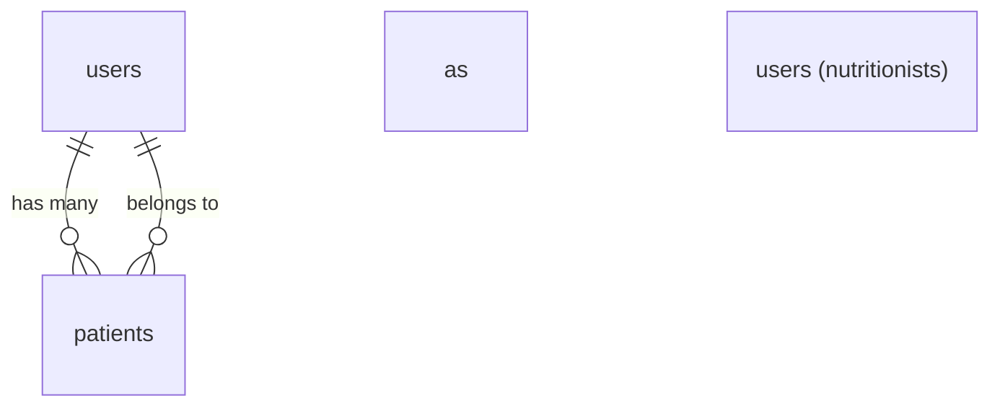

# Nutritionist–Patient DB relation and multi-tenant scoping

## Current state

- **[app/Models/Patient.php](app/Models/Patient.php)** – No relation to User; all patients are global.
- **[database/migrations/2026_02_11_160604_create_patients_table.php](database/migrations/2026_02_11_160604_create_patients_table.php)** – `patients` has no `user_id`; `id_number` is globally unique.
- **[app/Http/Controllers/PatientController.php](app/Http/Controllers/PatientController.php)** – Uses `Patient::query()` and `Patient::create()` with no user scoping; edit/update/destroy use route model binding with no scope.
- **[app/Http/Controllers/HomeController.php](app/Http/Controllers/HomeController.php)** – Stats use `Patient::query()` with no user filter.
- **Routes** – No auth middleware; anyone can access `/` and `/patients/`.

## Target design

- Each **User** = one nutritionist; each **Patient** belongs to exactly one User via `patients.user_id`.
- All patient listing, creation, and stats are scoped to the current user.
- Route model binding for `Patient` must resolve only patients owned by the current user (so one nutritionist cannot view/edit another’s patient by ID).

**Recommended execution order:** Do **5 (Authentication: Breeze + Socialite)** first, then 1 → 2 → 3 → 4 → 6 → 7.

## 1. Database migration

- **New migration** (do not modify the original `create_patients_table` so existing installs can migrate cleanly):
    - Add `user_id` to `patients`: `$table->foreignId('user_id')->constrained()->cascadeOnDelete();` (or `nullable()` first if you need to backfill existing rows to a default user, then a second migration to make it non-nullable and add the foreign key).
    - Drop the existing unique on `id_number` and add a **composite unique** on `(user_id, id_number)` so the same national ID can exist for different nutritionists:  
      `$table->unique(['user_id', 'id_number']);`
- **Data** (if you already have rows in `patients`): either run in a one-off migration or manually: set `user_id` for all existing patients to a chosen “owner” (e.g. first user), then make `user_id` non-nullable if you used nullable in the first step.

## 2. Models

- **[app/Models/Patient.php](app/Models/Patient.php)**
    - Add `user_id` to `$fillable` only if you intend to mass-assign it; otherwise keep it out and set it in the controller/observer.
    - Add `belongsTo(User::class)` relationship.
    - Optionally add a **global scope** that restricts to `user_id = auth()->id()` when a user is logged in (so every `Patient::query()` is automatically scoped). If you use a scope, use a named scope (e.g. `forCurrentUser()`) and apply it globally in `booted()` when `auth()->check()`, so console/seeders can use `Patient::withoutGlobalScope(ForUserScope::class)` when needed.
- **[app/Models/User.php](app/Models/User.php)**
    - Add `hasMany(Patient::class)`.

## 3. Scoped route model binding

- In **[routes/web.php](routes/web.php)** or in a **RouteServiceProvider** / **[bootstrap/app.php](bootstrap/app.php)** (Laravel 11+), register a custom binding for `patient` so that when a route has `{patient}`, it resolves to a patient that belongs to the current user, e.g.  
  `Patient::where('user_id', auth()->id())->findOrFail($value)`.  
  That way `edit`, `update`, and `destroy` automatically get 404 if the ID belongs to another nutritionist.

## 4. Controller and request changes

- **PatientController**
    - Ensure every patient query is for the current user: either rely on the global scope above or replace `Patient::query()` with `auth()->user()->patients()` (or `Patient::where('user_id', auth()->id())`).
    - On **store**: set `user_id` on the new patient (e.g. `Patient::create([...$request->validated(), 'user_id' => auth()->id()])`) and do not accept `user_id` from the request.
- **HomeController**
    - Replace `Patient::query()` with the same scoped source (e.g. `auth()->user()->patients()`) for all stats.
- **PatientRequest**
    - Update the **unique rule** for `id_number` to be **per user**:  
      `Rule::unique('patients', 'id_number')->where('user_id', auth()->id())->ignore($this->patient)`.
    - In `authorize()`, consider checking that the patient (when editing) belongs to the current user; with scoped binding this is redundant but makes intent clear.

## 5. Authentication (Breeze + Socialite)

**Order:** Do this first so you have `auth()->id()` for all later steps (migration, scoping, route binding).

### 5.1 Laravel Breeze

- Install Breeze with the **Inertia + React** stack to match the existing frontend ([Laravel Breeze docs](https://laravel.com/docs/starter-kits#laravel-breeze)). This adds login, registration, password reset, and session handling.
- After installation, apply the `auth` middleware to the home and patient routes (e.g. wrap the relevant route groups or routes in `middleware('auth')` in [routes/web.php](routes/web.php)). Unauthenticated users will be redirected to the Breeze login page.
- Resolve any conflicts with existing Inertia/React setup (e.g. shared layout or root component) so the app still loads correctly and Breeze auth pages render.

### 5.2 Laravel Socialite (Google)

- Install `laravel/socialite` and configure the **Google** driver (`.env`: `GOOGLE_CLIENT_ID`, `GOOGLE_CLIENT_SECRET`; Google Cloud Console: create OAuth 2.0 credentials, set redirect URI to `/auth/google/callback` or your chosen path).
- Add two routes: one to redirect to Google (e.g. `GET /auth/google`) and one for the callback (e.g. `GET /auth/google/callback`). In the callback controller (or closure): use Socialite to get the Google user, then find-or-create a local `User` by email (and optionally link a `google_id` if you add that column), log the user in with `Auth::login($user)`, and redirect to the app (e.g. dashboard or `/`).
- Optionally add a `google_id` (nullable string) column to `users` and store it on first Google login so the same Google account always maps to the same User. Use `email` as the primary find-or-create key if you do not add `google_id`.
- Add a “Sign in with Google” button or link on the Breeze login (and optionally register) page that points to `/auth/google`. The rest of the app (scoping, patient CRUD) is unchanged; it only cares that the user is logged in.

## 6. Factories and seeders

- **PatientFactory**
    - Associate each patient with a user: e.g. `user_id => User::factory()` or a fixed user id so tests/seeders create scoped data.
- **Seeders** (if any)
    - Create at least one User (nutritionist), then create Patients with that `user_id`.

## 7. Optional: Observer

- **PatientObserver** (or in the controller): When creating a patient, set `user_id` from `auth()->id()` if you do not put `user_id` in the request/fillable, so it cannot be overridden by the client.

## Summary of files to touch

| Area              | Files                                                                                                                                                                                                                                                |
| ----------------- | ---------------------------------------------------------------------------------------------------------------------------------------------------------------------------------------------------------------------------------------------------- |
| DB                | New migration: add `user_id`, composite unique `(user_id, id_number)`, drop old `id_number` unique                                                                                                                                                   |
| Models            | `Patient` (relation, optional global scope), `User` (hasMany patients)                                                                                                                                                                               |
| Binding           | `routes/web.php` or `bootstrap/app.php` / RouteServiceProvider for scoped `patient` binding                                                                                                                                                          |
| Controllers       | `PatientController` (scope queries, set `user_id` on create), `HomeController` (scope stats)                                                                                                                                                         |
| Request           | `PatientRequest` (unique `id_number` per user)                                                                                                                                                                                                       |
| Auth              | Breeze (Inertia + React): install, then protect home + patient routes with `auth` middleware. Socialite: install, Google OAuth routes + callback (find-or-create User, login), optional `google_id` on `users`; “Sign in with Google” on login page. |
| Factories/seeders | `PatientFactory` set `user_id`; seeders create user(s) and assign patients                                                                                                                                                                           |

This gives you a clear nutritionist–patient relation in the DB and application-level scoping so each nutritionist only sees and manages their own patients.
